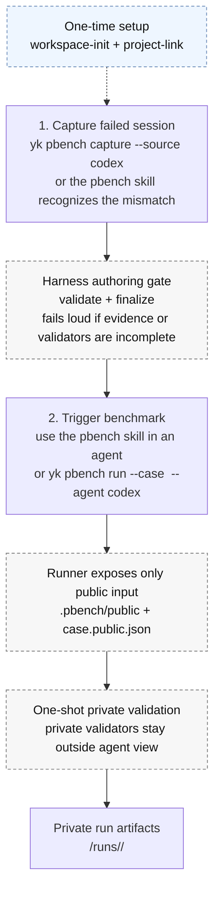

[English](./README.md) | [简体中文](./README.zh-CN.md)

<p align="center">
  
</p>

<p align="center">
  A personal skill catalog and the <code>yk</code> CLI that installs agent-ready skills into any repo
  <br/>and exposes their underlying functions as commands.
</p>

<p align="center">
  <a href="https://github.com/Yaphet2015/ya-skills/releases"></a>
  <a href="./LICENSE"></a>
  <a href="https://bun.sh"></a>
  <a href="https://www.typescriptlang.org/"></a>
  
  <a href="https://github.com/Yaphet2015/ya-skills/stargazers"></a>
</p>

<p align="center">
  <a href="#quick-start">Quick Start</a> ·
  <a href="#-available-skills">Skills</a> ·
  <a href="#commands">Commands</a> ·
  <a href="#development">Development</a> ·
  <a href="./docs/pbench.md">PBench Docs</a>
</p>

---

`yk` installs skills from this catalog into the current repository and exposes each skill's underlying functions as real CLI commands. One tool, two jobs: **drop skills into a project** and **run domain functions from the terminal**.

```sh
brew tap Yaphet2015/tap
brew install ya-skills

yk list                       # browse the catalog
yk install video-transcript   # install a skill into this repo
yk pbench capture --source codex --yes   # run a domain command
```

## ✨ Features

- **Install agent-ready skills in one command** — `yk install` writes skills into `.claude/skills` and/or `.agents/skills`, with sensible target detection so you never have to think about where they land.
- **Functions become commands** — every skill's underlying logic is reachable as `yk <domain> <action>`, so the same catalog powers both agents and plain shell workflows.
- **Dependency-aware, never destructive** — installing `demo-dependent` pulls in `demo-base`; `yk uninstall` removes only what you ask for and never silently nukes shared dependencies.
- **Batteries included** — ships ready-to-use skills for benchmarking, transcript extraction, and design grilling.
- **Single compiled binary** — `yk` ships as a Homebrew-pourable macOS arm64 binary that bundles the catalog, so installs don't depend on the source checkout.
- **Bun + TypeScript monorepo** — `packages/core` owns catalog/install logic, `packages/cli` owns routing, and each `packages/functions-*` package owns one domain. Clean boundaries, fast builds.

## 📦 Available Skills

| Skill | Description | Install |
| --- | --- | --- |
| **design-grill** | Stress-test an idea, design, plan, architecture, PRD, or implementation approach before coding, with a running `DESIGN-GRILL.md` decision summary. | `yk install design-grill` |
| **video-transcript** | Turn a video URL or local media/caption file into a transcript — captions first, Whisper ASR fallback. | `yk install video-transcript` |
| **pbench** | Capture real Codex workflow misses as local, private personal-benchmark cases, then replay them through a harness-managed runner without cloud sync or leaderboard upload. | `yk install pbench` |
| **demo-dependent** | Demo skill that depends on `demo-base` (used to verify dependency install). | `yk install demo-dependent` |
| **demo-base** | Tiny base dependency for CLI verification. | `yk install demo-base` |

> `pbench-runner` is installed automatically by `yk pbench start` into each prepared benchmark worktree — you don't install it manually.

Browse the full catalog at any time with `yk list`.

## 📑 Table of Contents

- [Features](#-features)
- [Available Skills](#-available-skills)
- [Quick Start](#quick-start)
- [Installation](#installation)
- [Commands](#commands)
  - [PBench](#pbench)
  - [Video Transcript](#video-transcript)
- [Development](#development)
- [Release](#release)
- [Contributing](#contributing)
- [License](#license)

## Quick Start

```sh
# 1. Install the yk binary (macOS arm64)
brew tap Yaphet2015/tap
brew install ya-skills

# 2. Browse and install a skill into the current repo
yk list
yk install video-transcript

# 3. Run a domain command
yk pbench capture --source codex --yes
```

## Installation

### Homebrew (recommended, macOS arm64)

```sh
brew tap Yaphet2015/tap
brew install ya-skills
```

The tap lives at [Yaphet2015/homebrew-tap](https://github.com/Yaphet2015/homebrew-tap). The formula installs the compiled `yk` binary and the bundled `skills/` catalog, and wraps `yk` with `YA_SKILLS_CATALOG_DIR` pointing at the installed catalog — so packaged installs never depend on the source checkout layout.

### From source (requires [Bun](https://bun.sh))

```sh
git clone https://github.com/Yaphet2015/ya-skills.git
cd ya-skills
bun install
bun run build                       # build the yk entrypoint
bun run build:binary:macos-arm64    # produce the compiled dist/yk binary
```

## Commands

- `yk list` — list skills in the local catalog.
- `yk install [skill...]` — install selected skills into the current repository.
- `yk uninstall <skill...>` — remove selected skills from existing skill targets in the current repository.
- `yk <domain> <action> [...args]` — run an underlying function (e.g. `yk pbench capture`).

**Install target detection** — `yk install` writes to the current working repository:

- If both `.claude/skills` and `.agents/skills` exist → installs to **both**.
- If only one exists → installs **there**.
- If neither exists → creates **`.agents/skills`**.

**Uninstall semantics** — `yk uninstall` removes from existing `.claude/skills` and `.agents/skills` targets only. It does **not** create target directories, and it does **not** remove dependency skills automatically.

### PBench

`yk pbench` captures real Codex workflow misses into fully local, private personal-benchmark cases, then replays finalized cases through a harness-managed runner. Use it to answer whether a model, skill, rules package, or harness change actually improves *your* workflow.

PBench is privacy-first by design: cases, raw transcripts, evaluator notes, private validators, and run reports stay in your local workspace. It does not upload cases to a hosted benchmark service, sync them to the cloud, or publish them to a public leaderboard. Benchmarked agents only receive the sanitized public replay capsule.

> 📖 Full documentation: **[PBench (English)](./docs/pbench.md)** · **[PBench 中文文档](./docs/pbench.zh-CN.md)**

The daily workflow is just two actions: **capture the bad session**, then **trigger a benchmark runner** later. Everything else is one-time setup or harness internals.



<details>
<summary><b>Command reference</b></summary>

- `yk pbench workspace-init <path>` — initialize a local pbench workspace.
- `yk pbench project-link --workspace <path>` — link the current project to a workspace.
- `yk pbench capture --source codex [--yes] [--input <jsonl>] [--session-id <id>]` — create an authoring transaction under `~/.ya-skills/pbench`, ask for confirmation unless `--yes` is passed, write a private authoring checklist, and print initial authoring validation warnings.
- `yk pbench validate --transaction <path> --strict` — strict-validate a transaction.
- `yk pbench finalize --transaction <path>` — finalize a strict-validated transaction into the workspace.
- `yk pbench export-replay --case <case-dir-or-case-id> --out <dir> [--workspace <path>] [--force]` — export a public-only replay capsule for an agent. Copies only sanitized `public/` files plus `case.public.json`; never exports private evaluator docs, validators, raw transcripts, or capture-only source paths.
- `yk pbench run --case <case-dir-or-case-id> --agent codex [--workspace <path>] [--profile <name>]` — run a finalized case through Codex in `<workspace>/.personal-bench/replays/<run-id>/worktree`, then run private validators and record the result under the workspace `runs/` directory. Profiles are user-supplied comparison labels (`baseline`, `current-model`, `current-skills`); omitted profiles are recorded as `default`.
- `yk pbench start --case <case-dir-or-case-id> [--workspace <path>] [--profile <name>]` — prepare a skill-mediated benchmark worktree at `<workspace>/.personal-bench/replays/<run-id>/worktree` for agents that cannot be launched by CLI. The prepared worktree contains `.pbench/public/`, `.pbench/case.public.json`, `.pbench/run.json`, and an installed `pbench-runner` skill.
- `yk pbench finish --run <run-id>` — perform the one-shot private validation for a skill-mediated run and print only the run id, status, and summary path.
- `yk pbench report [--workspace <path>] [--case <case-dir-or-case-id>] [--profile <name>] [--format json|markdown]` — aggregate existing run artifacts into status, case, profile, duration, and token summaries. JSON is the default; Markdown adds concise case and recent-run tables for human review.
- `yk pbench audit [--case <case-dir-or-case-id>] [--workspace <path>]` — check case quality without running private validators. With `--case`, audits one case; without `--case`, audits all finalized cases in the workspace. Reports invalid case shape, authoring warnings, and public replay references to private evaluator paths.

Install the capture workflow with `yk install pbench`. `yk pbench start` installs `pbench-runner` into each prepared benchmark worktree automatically.

</details>

### Video Transcript

`video-transcript` is an agent-facing skill for turning a video URL or local media/caption file into a transcript. It uses captions first, then falls back to audio-only local Whisper transcription when captions are missing.

```sh
yk install video-transcript
python3 .agents/skills/video-transcript/scripts/video_transcript.py "https://www.youtube.com/watch?v=..." \
  --format markdown \
  --output /absolute/path/transcript.md
```

The skill intentionally avoids full-video downloads for transcript-only work. URL inputs require `yt-dlp`; the ASR fallback requires either `mlx-whisper` or `faster-whisper`.

## Development

```sh
bun install
bun test                 # run the test suite
bun run typecheck        # tsc --noEmit
bun run build            # build the yk entrypoint
bun run build:binary:macos-arm64   # compile the dist/yk binary
bun run smoke            # quick end-to-end smoke test
```

This is a Bun workspace monorepo:

- `packages/cli` — owns the `yk` binary and command routing.
- `packages/core` — owns shared catalog, install, uninstall, target detection, dependency resolution, and function-registry logic.
- `packages/functions-demo` — the independent `yk demo <action>` command package.
- `packages/functions-pbench` — the independent `yk pbench <action>` command package.
- `skills/` — the local skill catalog installed by `yk install`.

## Release

Releases are automated with [Release Please](https://github.com/googleapis/release-please) plus the existing tag-based packaging workflow.

1. Land changes on `main` using Conventional Commit messages or PR titles:
   - `fix: ...` → patch release
   - `feat: ...` → minor release
   - `BREAKING CHANGE:` → major release
2. `.github/workflows/release-please.yml` opens or updates a Release PR that bumps `package.json`, maintains `CHANGELOG.md`, and prepares the next `v*` tag.
3. Merge the Release PR when ready.
4. The same workflow creates the GitHub Release and uploads:
   - `ya-skills-v<version>-macos-arm64.tar.gz`
   - `ya-skills-v<version>-macos-arm64.tar.gz.sha256`

The asset upload runs in the Release Please workflow because tags created by the default `GITHUB_TOKEN` do not trigger other workflows. `.github/workflows/release.yml` remains available for manual `v*` tag pushes. After publishing, update [Yaphet2015/homebrew-tap](https://github.com/Yaphet2015/homebrew-tap) with the new formula `version`, release asset URL, and sha256.

## Contributing

Contributions are welcome! The project follows [Conventional Commits](https://www.conventionalcommits.org/) and keeps domain command logic in its own `packages/functions-<domain>` package (never in `packages/cli`). Shared behavior belongs in `packages/core`.

- Prefer adding a failing test before changing behavior.
- Run `bun run typecheck && bun test` before opening a PR.
- Update this README and `AGENTS.md` when public CLI behavior changes.

## License

[MIT](./LICENSE) © 2026 [Yaphet2015](https://github.com/Yaphet2015)
