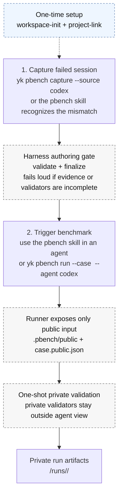

# ya-skills

Personal skill repository and CLI.

`yk` installs skills from this repository into the current project and exposes underlying functions as CLI commands.

This is a Bun workspace monorepo:

- `packages/cli` owns the `yk` binary.
- `packages/core` owns shared catalog, install, uninstall, target, dependency, and function-registry logic.
- `packages/functions-demo` owns the independent `yk demo <action>` command package.
- `packages/functions-pbench` owns the independent `yk pbench <action>` command package.
- `skills/video-transcript` owns the agent-facing video URL/file → transcript workflow.

## Installation

The published Homebrew formula currently supports macOS arm64.

```sh
brew tap Yaphet2015/tap
brew install ya-skills
```

The tap repository is [Yaphet2015/homebrew-tap](https://github.com/Yaphet2015/homebrew-tap). The formula installs the compiled `yk` binary and the bundled `skills/` catalog.

## Commands

- `yk list` lists local catalog skills.
- `yk install [skill...]` installs selected skills into the current repository.
- `yk uninstall <skill...>` removes selected skills from existing skill targets in the current repository.
- `yk <domain> <action> [...args]` runs an underlying function.

`yk install` writes to the current working repository. If `.claude/skills` and `.agents/skills` both exist, it installs to both. If one exists, it installs there. If neither exists, it creates `.agents/skills`.

`yk uninstall` removes from existing `.claude/skills` and `.agents/skills` targets only; it does not create default target directories and does not remove dependency skills automatically.

### PBench

`yk pbench` captures real Codex workflow misses into local private personal benchmark cases, then replays finalized cases through a harness-managed runner. Use it to answer whether a model, skill, rules package, or harness change improves your own workflow.

Full documentation:

- [PBench documentation (English)](docs/pbench.md)
- [PBench 中文文档](docs/pbench.zh-CN.md)

Daily workflow should feel like two actions: capture the bad session, then later trigger a benchmark runner. The other commands are either one-time setup or harness internals.



- `yk pbench workspace-init <path>` initializes a local pbench workspace.
- `yk pbench project-link --workspace <path>` links the current project to a workspace.
- `yk pbench capture --source codex [--yes] [--input <jsonl>] [--session-id <id>]` creates an authoring transaction under `~/.ya-skills/pbench`, asks for confirmation unless `--yes` is passed, writes a private authoring checklist, and prints initial authoring validation warnings.
- `yk pbench validate --transaction <path> --strict` strict-validates a transaction.
- `yk pbench finalize --transaction <path>` finalizes a strict-validated transaction into the workspace.
- `yk pbench export-replay --case <case-dir-or-case-id> --out <dir> [--workspace <path>] [--force]` exports a public-only replay capsule for an agent. It copies only sanitized `public/` files plus `case.public.json`; it never exports private evaluator docs, validators, raw transcripts, or capture-only source paths.
- `yk pbench run --case <case-dir-or-case-id> --agent codex [--workspace <path>] [--profile <name>]` runs a finalized case through Codex in `<workspace>/.personal-bench/replays/<run-id>/worktree`, then runs private validators and records the result under the workspace `runs/` directory. Profiles are user-supplied comparison labels such as `baseline`, `current-model`, or `current-skills`; omitted profiles are recorded as `default`.
- `yk pbench start --case <case-dir-or-case-id> [--workspace <path>] [--profile <name>]` prepares a skill-mediated benchmark worktree at `<workspace>/.personal-bench/replays/<run-id>/worktree` for agents that cannot be launched by CLI. The prepared worktree contains `.pbench/public/`, `.pbench/case.public.json`, `.pbench/run.json`, and an installed `pbench-runner` skill.
- `yk pbench finish --run <run-id>` performs the one-shot private validation for a skill-mediated run and prints only the run id, status, and summary path.
- `yk pbench report [--workspace <path>] [--case <case-dir-or-case-id>] [--profile <name>] [--format json|markdown]` aggregates existing run artifacts into status, case, profile, duration, and token summaries. JSON is the default; Markdown adds concise case and recent-run tables for human review.
- `yk pbench audit [--case <case-dir-or-case-id>] [--workspace <path>]` checks case quality without running private validators. With `--case`, it audits one case; without `--case`, it audits all finalized cases in the workspace. It reports invalid case shape, authoring warnings, and public replay references to private evaluator paths.

Install the capture workflow with `yk install pbench`. `yk pbench start` installs `pbench-runner` into each prepared benchmark worktree automatically.

### Video Transcript

`video-transcript` is an agent-facing skill for turning a video URL or local media/caption file into a transcript. It uses captions first, then falls back to audio-only local Whisper transcription when captions are missing.

```sh
yk install video-transcript
python3 .agents/skills/video-transcript/scripts/video_transcript.py "https://www.youtube.com/watch?v=..." \
  --format markdown \
  --output /absolute/path/transcript.md
```

The skill intentionally avoids full-video downloads for transcript-only work. URL inputs require `yt-dlp`; ASR fallback requires either `mlx-whisper` or `faster-whisper`.

## Development

```sh
bun install
bun test
bun run typecheck
bun run build
bun run build:binary:macos-arm64
```

## Release

Releases are automated with Release Please plus the existing tag-based packaging workflow.

### Automated release flow

1. Land normal changes on `main` using Conventional Commit messages or PR titles:
  - `fix: ...` creates a patch release.
  - `feat: ...` creates a minor release.
  - `BREAKING CHANGE:` creates a major release.
2. `.github/workflows/release-please.yml` opens or updates a Release PR that bumps `package.json`, maintains `CHANGELOG.md`, and prepares the next `v*` tag.
3. Merge the Release PR when ready.
4. The same workflow creates the GitHub Release and uploads:
  - `ya-skills-v<version>-macos-arm64.tar.gz`
  - `ya-skills-v<version>-macos-arm64.tar.gz.sha256`

The asset upload runs in the Release Please workflow because tags created by the default `GITHUB_TOKEN` do not trigger other workflows. `.github/workflows/release.yml` remains available for manual `v*` tag pushes.

The release tarball contains `yk` and `skills/`. The Homebrew formula wraps `yk` with `YA_SKILLS_CATALOG_DIR` pointing at the installed catalog, so packaged installs do not depend on the source checkout layout.

After publishing a new release, update `Yaphet2015/homebrew-tap` with the new formula `version`, release asset URL, and sha256.
