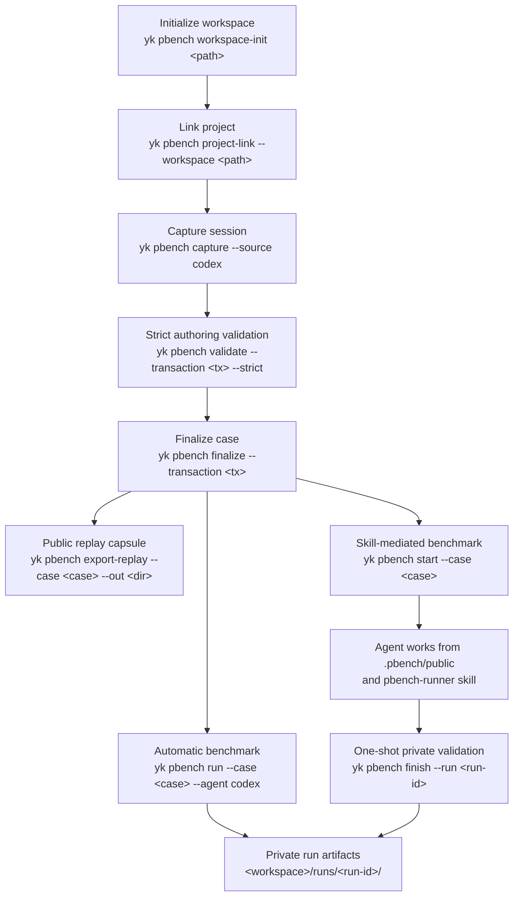

# ya-skills

Personal skill repository and CLI.

`yk` installs skills from this repository into the current project and exposes underlying functions as CLI commands.

This is a Bun workspace monorepo:

- `packages/cli` owns the `yk` binary.
- `packages/core` owns shared catalog, install, uninstall, target, dependency, and function-registry logic.
- `packages/functions-demo` owns the independent `yk demo <action>` command package.
- `packages/functions-pbench` owns the independent `yk pbench <action>` command package.
- `skills/video-transcript` owns the agent-facing video URL/file → transcript workflow.

## Installation

The published Homebrew formula currently supports macOS arm64.

```sh
brew tap Yaphet2015/tap
brew install ya-skills
```

The tap repository is [Yaphet2015/homebrew-tap](https://github.com/Yaphet2015/homebrew-tap). The formula installs the compiled `yk` binary and the bundled `skills/` catalog.

## Commands

- `yk list` lists local catalog skills.
- `yk install [skill...]` installs selected skills into the current repository.
- `yk uninstall <skill...>` removes selected skills from existing skill targets in the current repository.
- `yk <domain> <action> [...args]` runs an underlying function.

`yk install` writes to the current working repository. If `.claude/skills` and `.agents/skills` both exist, it installs to both. If one exists, it installs there. If neither exists, it creates `.agents/skills`.

`yk uninstall` removes from existing `.claude/skills` and `.agents/skills` targets only; it does not create default target directories and does not remove dependency skills automatically.

### PBench

`yk pbench` captures task/session-level outcome mismatch from Codex work into local private personal benchmark cases, then replays finalized cases through a harness-managed runner.

> I created pbench because public benchmarks and general rules packages cannot answer the question I actually need answered during daily agent work: did this model, skill, rules package, or harness change make my own workflow better? PBench turns real Codex misses into reproducible private cases with explicit success criteria and replay evidence, so failures become regression assets instead of one-off frustration.
>
> The important constraint is low-friction capture. When an agent fails, the useful evidence is still in the session: prompts, cwd, Git state, commands, touched files, tool calls, errors, sandbox and approval context, and the user's correction. PBench preserves that context before it disappears, while keeping private material separate from the public replay capsule. Later, those cases can be used to judge whether a workflow change reduced manual intervention, used tools correctly, completed verification, and solved the original task.

Basic workflow:



- `yk pbench workspace-init <path>` initializes a local pbench workspace.
- `yk pbench project-link --workspace <path>` links the current project to a workspace.
- `yk pbench capture --source codex [--yes] [--input <jsonl>] [--session-id <id>]` creates an authoring transaction under `~/.ya-skills/pbench`, asks for confirmation unless `--yes` is passed, and prints initial authoring validation warnings.
- `yk pbench validate --transaction <path> --strict` strict-validates a transaction.
- `yk pbench finalize --transaction <path>` finalizes a strict-validated transaction into the workspace.
- `yk pbench export-replay --case <case-dir-or-case-id> --out <dir> [--workspace <path>] [--force]` exports a public-only replay capsule for an agent. It copies only `public/` plus `case.public.json`; it never exports private evaluator docs, validators, or the raw transcript.
- `yk pbench run --case <case-dir-or-case-id> --agent codex [--workspace <path>]` runs a finalized case through Codex in a temporary worktree, then runs private validators and records the result under the workspace `runs/` directory.
- `yk pbench start --case <case-dir-or-case-id> [--workspace <path>]` prepares a skill-mediated benchmark worktree for agents that cannot be launched by CLI. The prepared worktree contains `.pbench/public/`, `.pbench/case.public.json`, `.pbench/run.json`, and an installed `pbench-runner` skill.
- `yk pbench finish --run <run-id>` performs the one-shot private validation for a skill-mediated run and prints only the run id, status, and summary path.

Capture supports both legacy and current Codex JSONL shapes. When a session records its own cwd and Git metadata, capture uses that session repository and baseline commit even if `yk pbench capture --input <jsonl>` is launched from another repo. If `--session-id` is used and the Codex index does not include file paths, capture scans `~/.codex/sessions/**/*.jsonl` for the matching session id.

Capture writes a replay context capsule into `public/`: `prompt.md`, `replay.md`, `replay.manifest.json`, `context.manifest.json`, repo agent instructions, filtered key observations, bounded command observations, a bounded dirty starting patch, and small non-ignored untracked text files. It also stores Codex prompts, timeline, tool calls, touched files, error records, approval/sandbox context, and generated private authoring docs in `private/`. Private `failure.md`, `success.md`, and `verification.md` are prefilled from session corrections and error evidence; failed replayable verification commands can become completion validators. If the session does not contain enough evidence, initial authoring warnings identify the missing failure or validator work before finalization. Setup detection supports Bun, pnpm, npm, and Yarn repositories.

Full case bundles are for authoring and harness validation. Agent-facing replay should use `public/replay.manifest.json`, `yk pbench export-replay`, `yk pbench run`, or a `yk pbench start` worktree, all of which give the agent only public inputs and a `case.public.json` view. Cases can declare replay requirements such as `live-integration`, network needs, and required environment variable names; strict validation and runner startup fail before replay when required variables are missing, without printing secret values.

Runner artifacts are private local benchmark records. Automatic Codex runs and skill-mediated runs write status, duration, redacted logs, diffs, and validator outcomes to `<workspace>/runs/<run-id>/`. Skill-mediated runs are one-shot: after `yk pbench finish --run <run-id>`, the agent sees only pass/fail-level output while private validator details remain in the workspace artifact directory.

Install the capture workflow with `yk install pbench`. `yk pbench start` installs `pbench-runner` into each prepared benchmark worktree automatically.

### Video Transcript

`video-transcript` is an agent-facing skill for turning a video URL or local media/caption file into a transcript. It uses captions first, then falls back to audio-only local Whisper transcription when captions are missing.

```sh
yk install video-transcript
python3 .agents/skills/video-transcript/scripts/video_transcript.py "https://www.youtube.com/watch?v=..." \
  --format markdown \
  --output /absolute/path/transcript.md
```

The skill intentionally avoids full-video downloads for transcript-only work. URL inputs require `yt-dlp`; ASR fallback requires either `mlx-whisper` or `faster-whisper`.

## Development

```sh
bun install
bun test
bun run typecheck
bun run build
bun run build:binary:macos-arm64
```

## Release

Releases are automated with Release Please plus the existing tag-based packaging workflow.

### Automated release flow

1. Land normal changes on `main` using Conventional Commit messages or PR titles:
   - `fix: ...` creates a patch release.
   - `feat: ...` creates a minor release.
   - `BREAKING CHANGE:` creates a major release.
2. `.github/workflows/release-please.yml` opens or updates a Release PR that bumps `package.json`, maintains `CHANGELOG.md`, and prepares the next `v*` tag.
3. Merge the Release PR when ready.
4. The same workflow creates the GitHub Release and uploads:
   - `ya-skills-v<version>-macos-arm64.tar.gz`
   - `ya-skills-v<version>-macos-arm64.tar.gz.sha256`

The asset upload runs in the Release Please workflow because tags created by the default `GITHUB_TOKEN` do not trigger other workflows. `.github/workflows/release.yml` remains available for manual `v*` tag pushes.

The release tarball contains `yk` and `skills/`. The Homebrew formula wraps `yk` with `YA_SKILLS_CATALOG_DIR` pointing at the installed catalog, so packaged installs do not depend on the source checkout layout.

After publishing a new release, update `Yaphet2015/homebrew-tap` with the new formula `version`, release asset URL, and sha256.
