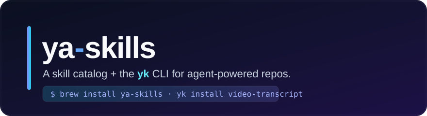
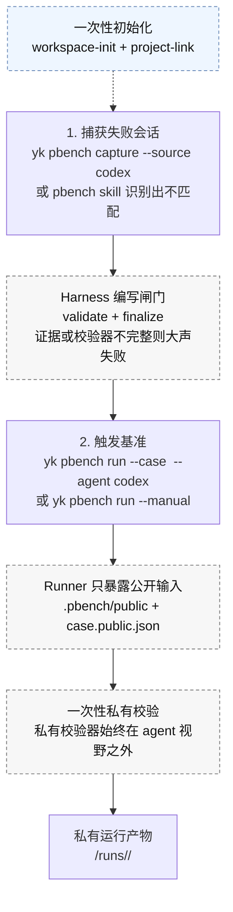

[English](./README.md) | [简体中文](./README.zh-CN.md)

# ya-skills

<p align="center">
  
</p>

<p align="center">
  面向 AI Agent 的 Skill 目录和 <code>yk</code> 命令行工具——把 Claude Code / Codex 可用的可复用 Skill 安装到任意仓库，
  <br/>并运行 PBench、视频文稿、设计评审、A 股数据获取等工作流工具。
</p>

<p align="center">
  <a href="https://github.com/Yaphet2015/ya-skills/releases"></a>
  <a href="./LICENSE"></a>
  <a href="https://bun.sh"></a>
  <a href="https://www.typescriptlang.org/"></a>
  
  <a href="https://github.com/Yaphet2015/ya-skills/stargazers"></a>
</p>

<p align="center">
  <a href="#快速开始">快速开始</a> ·
  <a href="#-可用-skills">Skills</a> ·
  <a href="#命令">命令</a> ·
  <a href="#开发">开发</a> ·
  <a href="./docs/pbench.zh-CN.md">PBench 文档</a>
</p>

---

## ya-skills 是什么？

`ya-skills` 是一个可复用的 **AI Agent Skill 目录**，也是一个名为 `yk` 的命令行工具。它可以把 Skill 安装进项目仓库，供 **Claude Code**、**OpenAI Codex** 以及其他兼容 `.agents/skills` 或 `.claude/skills` 的 Agent 工作流使用；同时，也能把部分 Skill 的底层能力暴露为普通终端命令。

一个工具，两件事：**把 Agent 可直接使用的 Skill 放进项目**，以及**在终端运行可重复的工作流自动化**。目前目录覆盖 PBench 个人基准、视频文稿提取、设计评审、A 股市场数据获取等场景。

```sh
brew tap Yaphet2015/tap
brew install ya-skills

yk list                       # 浏览目录
yk install video-transcript   # 把一个 Skill 安装到当前仓库
yk pbench capture --source codex --yes   # 运行一个领域命令
```

## ✨ 特性

- **一条命令安装 AI Agent Skill** —— `yk install` 会把可复用 Skill 写入 `.claude/skills` 和/或 `.agents/skills`，并带有合理的安装目标检测，方便 Claude Code、Codex 风格 Agent 和本地自动化共用同一份目录。
- **函数即命令** —— 部分 Skill 的底层逻辑能通过 `yk <domain> <action>` 调用，同一份目录既能驱动 Agent 工作流，也能驱动纯命令行自动化。
- **感知依赖、绝不破坏** —— `yk install` 会先解析并安装所需 Skill；`yk uninstall` 只删除你指定的内容，绝不会悄悄删除共享依赖。
- **开箱即用** —— 自带可用 Skill，覆盖基准测试、视频文稿提取和设计追问。
- **单一编译二进制** —— `yk` 以可 Homebrew 安装的 macOS arm64 二进制形式发布，并内置目录，安装时不依赖源码检出。
- **Bun + TypeScript 单仓多包** —— `packages/core` 负责目录/安装逻辑，`packages/cli` 负责路由，每个 `packages/functions-*` 包负责一个领域。边界清晰、构建快速。

## 📦 可用 Skills

| Skill | 说明 | 安装命令 |
| --- | --- | --- |
| **a-share-data** | 从公开数据源获取 A 股报价、K 线、财务指标、现金流和公告，并保留来源与缺失字段说明，避免编造数据。 | `yk install a-share-data` |
| **design-grill** | 在写代码前压测想法、设计、计划、架构、PRD 或实现方案，并维护一份 `DESIGN-GRILL.md` 决策总结。 | `yk install design-grill` |
| **video-transcript** | 把视频 URL 或本地媒体/字幕文件转成文稿——优先用字幕，缺失时回退到 Whisper ASR。 | `yk install video-transcript` |
| **pbench** | 把真实的 Codex 或 Claude 工作流失误捕获为本地、私有基准用例，再通过已注册 runner 重放，不做云同步，也不会上传到公开榜单。 | `yk install pbench` |
| **eli5** | 当读者完全不懂这个主题来解释：用 HTML artifact，大图、少字。 | `yk install eli5` |
| **plan-jury** | 手动调用 `/plan-jury`，让 Sol、Grok 和 GLM 评审开发计划、设计，或方案取舍（做不做 / 选哪条）。它不会被隐式触发。 | `yk install plan-jury` |
| **validator** | 在 Plan 完成后手动调用 `/validator`，独立建立基于证据的 Completion Standard；不验证实现，也不会被隐式触发。 | `yk install validator` |

> `pbench-runner` 是内部资产，会由 `yk pbench run --manual`（或兼容的 `start` 命令）自动安装，无需从目录手动安装。

随时用 `yk list` 浏览完整目录。

## 📑 目录

- [ya-skills 是什么？](#ya-skills-是什么)
- [特性](#-特性)
- [可用 Skills](#-可用-skills)
- [快速开始](#快速开始)
- [安装](#安装)
- [命令](#命令)
  - [PBench](#pbench)
  - [Video Transcript](#video-transcript)
- [开发](#开发)
- [发布](#发布)
- [贡献](#贡献)
- [许可证](#许可证)

## 快速开始

```sh
# 1. 安装 yk 二进制（macOS arm64）
brew tap Yaphet2015/tap
brew install ya-skills

# 2. 浏览并把一个 Skill 安装到当前仓库
yk list
yk install video-transcript

# 3. 运行一个领域命令
yk pbench capture --source codex --yes
```

## 安装

### Homebrew（推荐，macOS arm64）

```sh
brew tap Yaphet2015/tap
brew install ya-skills
```

Tap 仓库位于 [Yaphet2015/homebrew-tap](https://github.com/Yaphet2015/homebrew-tap)。该 formula 会安装编译好的 `yk` 二进制和内置的 `skills/` 目录，并用 `YA_SKILLS_CATALOG_DIR` 包装 `yk`，指向已安装的目录——因此打包安装完全不依赖源码检出布局。

### 从源码构建（需要 [Bun](https://bun.sh)）

```sh
git clone https://github.com/Yaphet2015/ya-skills.git
cd ya-skills
bun install
bun run build                       # 构建 yk 入口
bun run build:binary:macos-arm64    # 产出编译好的 dist/yk 二进制
```

## 命令

全局参数：

- `-h`, `--help` —— 显示帮助。
- `-v`, `--version` —— 显示当前安装的 `yk` 版本。

- `yk list` —— 列出本地目录中的 Skill。
- `yk install [skill...]` —— 把选中的 Skill 安装到当前仓库。
- `yk install -g [skill...]` —— 把选中的 Skill 安装到用户级目标；也支持 `--global`。
- `yk uninstall <skill...>` —— 从当前仓库已有的 Skill 目标中移除选中的 Skill。
- `yk uninstall -g <skill...>` —— 从用户级已有目标中移除选中的 Skill；也支持 `--global`。
- `yk <domain> <action> [...args]` —— 运行一个底层函数（例如 `yk pbench capture`）。

**安装目标检测** —— `yk install` 默认使用当前工作仓库。使用 `-g` 或 `--global` 时，它使用用户主目录。在选定的根目录中：

- 若 `.claude/skills` 和 `.agents/skills` 都存在 → 安装到**两者**。
- 若只存在其中一个 → 安装到**那个目录**。
- 若都不存在 → 创建 **`.agents/skills`**。

**重复安装** —— `yk install` 会用目录中的版本覆盖已安装的 Skill。该 Skill 目录里多出来的本地文件会被删除。

**卸载语义** —— `yk uninstall` 只从已有的 `.claude/skills` 和 `.agents/skills` 目标中移除。使用 `-g` 或 `--global` 时，它使用用户主目录。它**不会**创建目标目录，也**不会**自动移除依赖 Skill。

### PBench

`yk pbench` 通过已注册 capture source 捕获真实的 Codex 或 Claude 工作流失误，再通过已注册 runner 重放已定稿用例。用它来判断模型、Skill、规则包或 harness 改动是否*真的*改善了*你自己的*工作流。

PBench 默认按隐私优先设计：case、原始 transcript、评估说明、私有校验器和运行报告都留在你的本地 workspace。它不会把 case 上传到托管 benchmark 服务，不会做云同步，也不会发布到公开排行榜。被测 agent 只能看到脱敏后的 public replay capsule。

> 📖 完整文档：**[PBench 中文文档](./docs/pbench.zh-CN.md)** · **[PBench (English)](./docs/pbench.md)**

日常工作流只有两个动作：**捕获糟糕的会话**，之后再**触发基准 runner**。其余要么是一次性初始化，要么是 harness 内部细节。



<details>
<summary><b>命令参考</b></summary>

- `yk pbench workspace-init <path>` —— 初始化一个本地 pbench 工作区。
- `yk pbench project-link --workspace <path>` —— 把当前项目链接到某个工作区。
- `yk pbench capture --source <source> [--yes] [--input <jsonl>] [--session-id <id>]` —— 通过已注册 source（`codex` 或 `claude`）捕获 session，写入私有 authoring checklist，并打印一个 next action。`--input` 只向选中的 source 提供 transcript，不启用任意 source。
- `yk pbench validate --transaction <path> --strict` —— 严格校验某个事务。
- `yk pbench finalize --transaction <path>` —— 把一个已通过严格校验的事务定稿进工作区。
- `yk pbench export-replay --case <case-dir-or-case-id> --out <dir> [--workspace <path>] [--force]` —— 为 agent 导出一个仅含公开内容的重放胶囊。只复制脱敏后的 `public/` 文件和 `case.public.json`；绝不导出私有评估文档、校验器、原始转录或仅用于捕获的源路径。
- `yk pbench run --case <case-dir-or-case-id> --agent <agent> [--workspace <path>] [--profile <name>]` —— 通过已注册 runner 运行 finalized case。当前内置 runner 为 `codex` 和 `claude`。
- `yk pbench run --case <case-dir-or-case-id> --manual [--workspace <path>] [--profile <name>]` —— 为不能 headless 启动的 agent 准备 manual benchmark worktree，并安装内部 `pbench-runner` asset。
- `yk pbench start --case <case-dir-or-case-id> [--workspace <path>] [--profile <name>]` —— manual preparation path 的兼容命令。
- `yk pbench finish --run <run-id>` —— 为 manual run 执行一次性私有校验，只打印 run id 和状态。
- `yk pbench report [--workspace <path>] [--case <case-dir-or-case-id>] [--profile <name>] [--format json|markdown]` —— 默认渲染 Markdown 比较报告；自动化请使用 `yk pbench report --format json`。
- `yk pbench audit [--case <case-dir-or-case-id>] [--workspace <path>]` —— 不运行私有校验器，检查用例质量。带 `--case` 时审核单个用例；不带时审核工作区中所有已定稿用例。会报告用例形状非法、编写警告，以及公开重放引用了私有评估路径的情况。

用 `yk install pbench` 安装 operator workflow。`yk pbench run --manual` 会自动把内部 `pbench-runner` asset 安装到准备好的 benchmark worktree。

</details>

### Video Transcript

`video-transcript` 是一个面向 agent 的 skill，用于把视频 URL 或本地媒体/字幕文件转成文稿。它优先使用字幕，缺失时回退到仅音频的本地 Whisper 转录。

```sh
yk install video-transcript
python3 .agents/skills/video-transcript/scripts/video_transcript.py "https://www.youtube.com/watch?v=..." \
  --format markdown \
  --output /absolute/path/transcript.md
```

该 skill 在仅需文稿的场景下刻意避免下载整段视频。URL 输入需要 `yt-dlp`；ASR 回退需要 `mlx-whisper` 或 `faster-whisper`。

## 开发

```sh
bun install
bun test                 # 运行测试套件
bun run typecheck        # tsc --noEmit
bun run build            # 构建 yk 入口
bun run build:binary:macos-arm64   # 编译 dist/yk 二进制
bun run smoke            # 快速端到端冒烟测试
```

这是一个 Bun workspace 单仓多包仓库：

- `packages/cli` —— 负责 `yk` 二进制与命令路由。
- `packages/core` —— 负责共享的目录、安装、卸载、目标检测、依赖解析与函数注册逻辑。
- `packages/functions-demo` —— 一个很小的 `yk demo <action>` 示例命令包，用于 CLI / function-registry 测试。
- `packages/functions-pbench` —— 独立的 `yk pbench <action>` 命令包。
- `skills/` —— 由 `yk install` 安装的本地 skill 目录。

## 发布

发布由 [Release Please](https://github.com/googleapis/release-please) 自动化，并配合既有的基于 tag 的打包工作流。

1. 使用约定式提交（Conventional Commits）的消息或 PR 标题把改动合入 `main`：
   - `fix: ...` → patch 发布
   - `feat: ...` → minor 发布
   - `BREAKING CHANGE:` → major 发布
2. `.github/workflows/release-please.yml` 会打开或更新一个 Release PR，它负责升 `package.json` 版本、维护 `CHANGELOG.md`，并准备下一个 `v*` tag。
3. 在合适时合并该 Release PR。
4. 同一个工作流会创建 GitHub Release 并上传：
   - `ya-skills-v<version>-macos-arm64.tar.gz`
   - `ya-skills-v<version>-macos-arm64.tar.gz.sha256`

资源上传放在 Release Please 工作流里执行，因为由默认 `GITHUB_TOKEN` 创建的 tag 不会触发其他工作流。`.github/workflows/release.yml` 仍可用于手动推送 `v*` tag。发布后，请用新的发布资源 URL 和 sha256 更新 [Yaphet2015/homebrew-tap](https://github.com/Yaphet2015/homebrew-tap)。不要写 formula `version`；Homebrew 会从 GitHub release URL 读出版本。

## 贡献

欢迎贡献！本项目遵循 [约定式提交](https://www.conventionalcommits.org/)，领域命令逻辑都放在各自的 `packages/functions-<domain>` 包里（绝不放在 `packages/cli`）。共享行为归入 `packages/core`。

- 修改行为前，优先先加一个会失败的测试。
- 开 PR 前运行 `bun run typecheck && bun test`。
- 当公开 CLI 行为发生变化时，更新本 README 和 `AGENTS.md`。

## 许可证

[MIT](./LICENSE) © 2026 [Yaphet2015](https://github.com/Yaphet2015)
