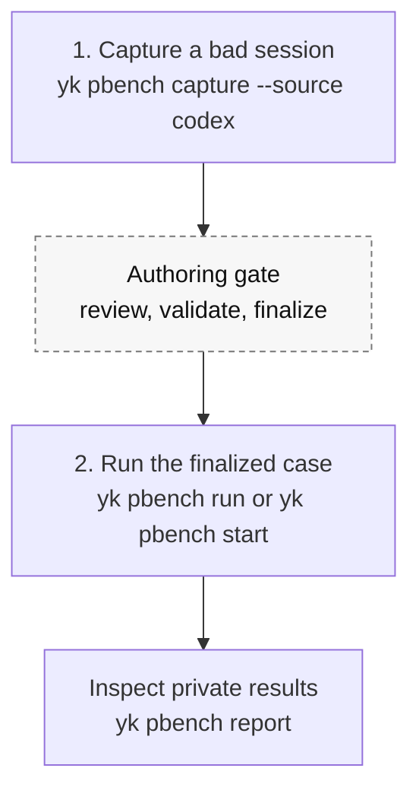

# PBench

PBench is a local, private benchmark workflow for coding-agent work. It turns a real agent miss into a reproducible case, then uses that case to check whether a model, skill, rules package, or harness change improves the user's actual workflow.

PBench is not a public leaderboard and it does not try to measure general model ability. Its signal comes from failures that already happened in real work: the agent claimed success too early, missed context, used tools incorrectly, failed verification, or needed user correction before the task was actually usable.

## Contents

- [Why PBench Exists](#why-pbench-exists)
- [What PBench Captures](#what-pbench-captures)
- [How The Workflow Feels](#how-the-workflow-feels)
- [Core Concepts](#core-concepts)
- [How PBench Works](#how-pbench-works)
- [Implementation Notes](#implementation-notes)
- [Privacy Boundary](#privacy-boundary)
- [Command Reference](#command-reference)
- [Common Workflows](#common-workflows)
- [Troubleshooting](#troubleshooting)

## Why PBench Exists

Public benchmarks can answer whether a model performs well on a fixed public task set. They usually cannot answer the question that matters during daily agent use:

> Did this model, skill, rules package, or harness change make my own workflow better?

PBench exists because real work produces better benchmark cases than synthetic guesses. When an agent fails in a real repository, the useful evidence is still nearby: the original prompt, working directory, Git baseline, tool calls, command output, touched files, sandbox and approval context, and the user's correction. PBench preserves that evidence before it disappears and turns it into a private regression asset.

The intended feedback loop is:

1. A real agent workflow fails or needs correction.
2. The failure is captured as a private benchmark case.
3. The case is finalized only after strict validation proves it has a replayable baseline and completion check.
4. Future agents, models, rules, skills, or harness changes are run against the case.
5. Reports show whether the change reduced failures, manual intervention, time, or token cost.

## What PBench Captures

PBench captures task/session-level outcome mismatch, not ordinary intermediate errors. A case is worth capturing when the final or claimed result was wrong, incomplete, or disproved by verification.

Good capture candidates include:

- the agent said the task was complete, but the result was wrong;
- the user corrected the agent after it produced work;
- verification disproved a completion claim;
- the agent missed required project context and had to redo the task;
- the agent solved a narrow helper problem but failed the real product-command boundary.

Poor capture candidates include:

- expected failing tests during a normal TDD loop;
- transient shell, network, or tool failures that were corrected inside a healthy workflow;
- exploratory attempts before the agent made a final claim;
- process complaints that did not produce an observable outcome mismatch.

## How The Workflow Feels

Most daily usage should feel like two actions.



The authoring gate is necessary because a benchmark case without clear failure evidence and an executable success check is not useful. However, the user-facing mental model is still simple: capture the failed session now, then later run the case when comparing changes.

## Core Concepts

### Workspace

A PBench workspace is the durable local benchmark store. It contains finalized cases, bare Git repository caches, run artifacts, and replay worktrees.

Typical workspace:

```text
~/.personal-bench/workspace/
  .personal-bench/workspace.json
  cases/
  repos/
  runs/
  .personal-bench/replays/
```

Initialize one with:

```sh
yk pbench workspace-init ~/.personal-bench/workspace
```

A project can be linked to a workspace:

```sh
yk pbench project-link --workspace ~/.personal-bench/workspace
```

The project link writes `.personal-bench/workspace.json` in the current project. PBench can also resolve a workspace from `--workspace`, `PERSONAL_BENCH_WORKSPACE`, an ancestor project link, `~/.personal-bench/config.json`, or the default workspace created by capture with `--yes`.

### Authoring Transaction

Capture does not immediately finalize a case. It creates an authoring transaction under:

```text
~/.ya-skills/pbench/tx_<slug>_<timestamp>_*/
  transaction.json
  case/
  replay/
```

The transaction is durable enough to inspect later, but it is still draft state. Review the generated case bundle, fix any warnings, run strict validation, and then finalize.

### Case

A case is the benchmark unit. Finalized cases live under:

```text
<workspace>/cases/<case-id>/
```

Each case contains:

```text
case.json
README.md
public/
private/
```

`case.json` is the manifest. It records the case id, title, privacy level, source metadata, subject repository baseline, setup commands, validators, replay requirements, and document paths.

### Public Replay Capsule

The `public/` directory is the only input a benchmarked agent should see. It includes the task prompt and replay context:

```text
public/
  prompt.md
  context.md
  environment.md
  replay.md
  replay.manifest.json
  context.manifest.json
  agent-instructions.md
  key-observations.md
  command-observations.md
  starting.patch
  context-files/untracked/
```

Not every file is always present. For example, `starting.patch` appears only when capture found tracked dirty changes small enough to expose publicly.

### Private Evaluator Material

The `private/` directory contains material used for authoring and validation, never for agent replay:

```text
private/
  authoring-checklist.md
  failure.md
  failure-draft.md
  success.md
  verification.md
  validators/check-completion.mjs
  artifacts/raw/codex-session.jsonl
  artifacts/extracted/
```

Private files can contain raw transcript details, evaluator intent, validator code, and failure analysis. Do not copy them into public replay input.

### Run

A run is one attempt to solve a finalized case under a named profile such as `baseline`, `current-model`, `current-skills`, or `new-harness`.

Run artifacts live under:

```text
<workspace>/runs/<run-id>/
```

They include status, duration, metrics, events, runner environment, redacted logs, diffs, candidate artifacts, validator outcomes, and `summary.md`.

## How PBench Works

### 1. Capture reads a Codex session

Current capture supports Codex JSONL sessions:

```sh
yk pbench capture --source codex --yes
yk pbench capture --source codex --input /path/to/session.jsonl --yes
yk pbench capture --source codex --session-id <id> --yes
```

Capture can read both legacy and current Codex JSONL shapes. It extracts:

- session metadata, including cwd, model, CLI version, sandbox, approval policy, and Git metadata when present;
- user messages, excluding injected AGENTS/environment context;
- assistant messages;
- tool calls and tool outputs;
- command failures and non-zero exit codes;
- approval and sandbox records;
- touched files;
- a bounded timeline.

When the session records its own cwd and Git metadata, capture uses the session repository and baseline commit even if `yk pbench capture --input <jsonl>` is launched from another repository. If `--session-id` is used and the Codex index lacks a file path, capture scans `~/.codex/sessions/**/*.jsonl` for the matching session id.

### 2. Capture builds the case skeleton

Capture resolves the subject Git repository and baseline commit, syncs the commit into the workspace `repos/` bare cache, creates a transaction under `~/.ya-skills/pbench`, and writes the `case/` bundle.

It generates public replay input from the session and repository:

- `public/prompt.md` from the original task prompt;
- `public/context.md` from capture metadata;
- `public/environment.md` from capture timestamp and model;
- `public/replay.md` as the future agent's context index;
- `public/agent-instructions.md` from AGENTS.md files between repo root and capture cwd, plus installed skill names;
- `public/key-observations.md` from failed commands and replayable verification commands;
- `public/command-observations.md` from bounded command/tool context;
- `public/starting.patch` when tracked dirty changes are small enough;
- small non-ignored untracked UTF-8 files under `public/context-files/untracked/`.

It generates private authoring and evaluator material:

- `private/failure.md` from user correction and error evidence;
- `private/success.md` from the original prompt and correction evidence;
- `private/verification.md` from failed verification evidence;
- `private/failure-draft.md` as deterministic supporting evidence;
- raw and extracted session artifacts;
- `private/validators/check-completion.mjs`.

### 3. Capture detects setup and validators

Setup command detection is package-manager based:

- `bun install --frozen-lockfile` for `bun.lock` or `bun.lockb`;
- `pnpm install --frozen-lockfile` for `pnpm-lock.yaml`;
- `npm ci` for `package-lock.json`;
- `yarn install --frozen-lockfile` for `yarn.lock`.

If capture finds a failed replayable verification command, it can promote that command into the completion validator. A command is considered replayable when it:

- starts with `bun`, `npm`, `pnpm`, or `yarn`;
- contains a verification word such as `test`, `typecheck`, `build`, `lint`, `check`, or `verify`;
- has no shell metacharacters that make replay unsafe;
- ran from a cwd that can be mapped into the replay worktree.

If no safe command is found, the validator remains intentionally unfinished with the `PBENCH_AUTHORING_REQUIRED` sentinel. Strict validation fails on that sentinel so an incomplete benchmark cannot be finalized silently.

### 4. Authoring validation fails loud

Capture prints `initialValidation` and `next` steps. Review:

```sh
yk pbench validate --transaction <tx-path> --strict
yk pbench finalize --transaction <tx-path>
```

Non-strict validation checks case shape and safe paths. Strict validation also checks required environment variables, rejects unimplemented validators, prepares a replay worktree at the baseline commit, runs setup commands, and runs validators against the baseline expectation. For completion validators generated by capture, the baseline is expected to fail because the original problem should still exist at the captured commit.

Only strict-validated transactions should be finalized into `<workspace>/cases/<case-id>`.

### 5. Replay exposes only public input

For agent replay, PBench prepares a worktree from the cached baseline commit and exposes:

```text
.pbench/public/
.pbench/case.public.json
.pbench/run.json
```

`case.public.json` is derived from `case.json` and removes private document paths and `sourceRootAtCapture`.

Replay startup fails closed if public agent-visible input contains private evaluator references such as `/private`, `private/...`, `PB_PRIVATE_DIR`, `PB_CASE_DIR`, raw transcript paths, validator paths, or the original case directory.

### 6. The runner validates privately

`yk pbench run` launches Codex automatically. `yk pbench start` prepares a worktree for skill-mediated agents, and `yk pbench finish` performs the one-shot private validation after the agent completes the public task.

Both paths run private validators outside the agent-visible capsule and write local private run artifacts under `<workspace>/runs/<run-id>/`.

Run statuses include:

- `passed`
- `setup_failed`
- `agent_failed`
- `validator_failed`
- `blocked`
- `running`

## Implementation Notes

PBench is implemented as a normal `ya-skills` function package:

- `packages/functions-pbench` owns `yk pbench <action>` behavior.
- `packages/cli` registers the function package so it is available through `yk`.
- `packages/core` provides the shared function registry used by CLI packages.
- `skills/pbench` is the agent-facing capture workflow skill.
- `skills/pbench-runner` is installed into worktrees prepared by `yk pbench start`.
- `tests/pbench.test.ts` covers workspace resolution, capture, validation, public/private boundaries, automatic runs, skill-mediated runs, reports, and audits.

Important implementation boundaries:

- Capture authoring transactions belong under `~/.ya-skills/pbench`.
- Finalized cases, repo caches, run artifacts, and replay worktrees belong to the PBench workspace.
- Replay worktrees are temporary workspace-owned execution areas, not durable authoring state.
- Public replay files are sanitized; private validator and raw transcript files stay out of agent view.
- Required replay environment variables are recorded by name only. Secret values are read from the environment at validation/runtime and redacted from persisted logs.

## Privacy Boundary

PBench assumes cases are private by default:

```json
{
  "privacy": { "level": "private" }
}
```

The privacy design is simple:

- public files are for replay input;
- private files are for authoring, evaluator intent, raw evidence, and validators;
- benchmarked agents get public input only;
- private validators run after the agent finishes;
- exports and prepared worktrees are checked for private path leaks before use.

Use `yk pbench export-replay` when you need a standalone public capsule:

```sh
yk pbench export-replay --case <case-id-or-dir> --out /tmp/pbench-replay
```

The export contains only:

```text
case.public.json
public/
```

## Command Reference

### `yk pbench workspace-init <path>`

Initializes a local PBench workspace. It creates workspace metadata, `cases/`, and `repos/`. It does not create a Git repository.

### `yk pbench project-link --workspace <path>`

Links the current project to an initialized workspace by writing `.personal-bench/workspace.json`.

### `yk pbench capture --source codex [--yes] [--input <jsonl>] [--session-id <id>] [--workspace <path>] [--title <title>]`

Creates an authoring transaction from a Codex session. Without `--yes`, interactive capture asks for confirmation with the session path, repository, baseline commit, and title. In non-interactive mode, pass `--yes`.

Output includes the transaction path, case directory, case id, workspace root, authoring checklist path, warnings, initial validation, and next commands.

### `yk pbench validate --transaction <path> [--strict]`

Validates a transaction. Use `--strict` before finalizing.

### `yk pbench validate --case <case-dir> [--strict] [--workspace <path>]`

Validates a case directory directly.

### `yk pbench finalize --transaction <path>`

Finalizes a strict-validated transaction into `<workspace>/cases/<case-id>`.

### `yk pbench export-replay --case <case-id-or-dir> --out <dir> [--workspace <path>] [--force]`

Exports the public replay capsule for external inspection or manual agent setup.

### `yk pbench run --case <case-id-or-dir> --agent codex [--workspace <path>] [--profile <name>]`

Runs a finalized case through the harness-managed Codex path. In v1, the automatic agent value must be `codex`.

### `yk pbench start --case <case-id-or-dir> [--workspace <path>] [--profile <name>]`

Prepares a skill-mediated replay worktree and installs the `pbench-runner` skill there. Use this when the benchmarked agent cannot be launched by `yk pbench run`.

### `yk pbench finish --run <run-id>`

Finishes a skill-mediated run with private validation. This is one-shot; a finished run cannot be finished again.

### `yk pbench report [--workspace <path>] [--case <case-id-or-dir>] [--profile <name>] [--format json|markdown]`

Aggregates run artifacts by status, case, profile, manual intervention, duration, and token usage. JSON is the default; Markdown is for human review.

### `yk pbench audit [--case <case-id-or-dir>] [--workspace <path>]`

Checks case quality without running private validators. It reports malformed cases, authoring warnings, and public/private boundary leaks.

## Common Workflows

### Install the agent capture skill

```sh
yk install pbench
```

The `pbench` skill tells an agent when a session is benchmark-worthy and how to capture it after the user approves. `yk pbench start` installs `pbench-runner` automatically in prepared replay worktrees.

### First-time setup

```sh
yk pbench workspace-init ~/.personal-bench/workspace
yk pbench project-link --workspace ~/.personal-bench/workspace
```

Run `project-link` from each repository you want associated with the workspace.

### Capture the current failed Codex session

Run from the subject repository:

```sh
yk pbench capture --source codex --yes
```

For an older session:

```sh
yk pbench capture --source codex --input /absolute/path/to/session.jsonl --yes
```

or:

```sh
yk pbench capture --source codex --session-id <session-id-fragment> --yes
```

Then inspect the printed `caseDir` and `authoringChecklistPath`.

### Finish authoring and finalize

```sh
yk pbench validate --transaction <tx-path> --strict
yk pbench finalize --transaction <tx-path>
```

If strict validation fails, fix the generated `case/` bundle inside the transaction. Common fixes are refining `private/failure.md`, `private/success.md`, `private/verification.md`, or implementing `private/validators/check-completion.mjs`.

### Run an automatic Codex benchmark

```sh
yk pbench run --case <case-id> --agent codex --profile current-model
```

Inspect the returned `summaryPath` and artifact directory.

### Run a skill-mediated benchmark

```sh
yk pbench start --case <case-id> --profile current-skills
```

Open the returned worktree with the benchmarked agent. The worktree contains `.pbench/run.json` and an installed `pbench-runner` skill. The agent should complete the task using only `.pbench/public/`, then run:

```sh
yk pbench finish --run <run-id>
```

### Compare profiles

Use stable profile names:

```sh
yk pbench run --case <case-id> --agent codex --profile baseline
yk pbench run --case <case-id> --agent codex --profile current-model
yk pbench report --format markdown
```

Profiles are labels. They do not change runtime behavior by themselves; they make reports comparable.

## Troubleshooting

### `No personal-bench workspace found`

Initialize a workspace or pass `--workspace`:

```sh
yk pbench workspace-init ~/.personal-bench/workspace
yk pbench capture --source codex --workspace ~/.personal-bench/workspace --yes
```

### `Not a personal-bench workspace: <path>`

The path exists but was not initialized. Run:

```sh
yk pbench workspace-init <path>
```

Then retry the original command.

### Capture created a transaction but strict validation fails

This is expected when capture could not infer a safe completion validator. Read:

- `private/authoring-checklist.md`
- `private/failure.md`
- `private/success.md`
- `private/verification.md`
- `private/validators/check-completion.mjs`

Implement the validator from the captured correction evidence, then rerun strict validation.

### Required environment variables are missing

Cases can declare replay requirements such as live integration, network needs, and required environment variable names. Strict validation and runner startup fail before replay when required variables are missing. Export the variables in your shell, but do not write secret values into case docs.

### Public replay export fails because of private paths

Public replay input must not reference private evaluator material, validator paths, raw transcripts, or the original case directory. Move evaluator-only details to `private/`, sanitize the public file, and retry.

### A run failed before private validation

Check the run status:

- `setup_failed`: setup command failed before the agent ran.
- `agent_failed`: the agent process exited non-zero.
- `validator_failed`: the agent ran, but private validators failed.

Inspect `<workspace>/runs/<run-id>/summary.md`, `runner-environment.json`, logs, `agent.diff`, and `candidate/` artifacts.

