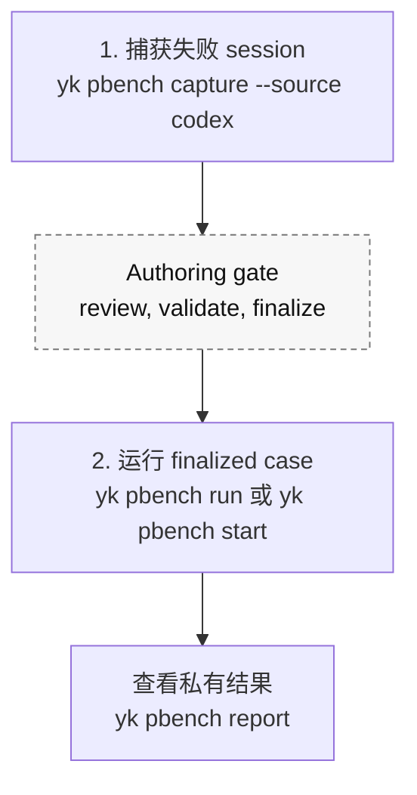

# PBench 中文文档

PBench 是一套完全本地、隐私优先的 coding agent benchmark 工作流。它把真实工作中发生过的 agent 失误沉淀成可复现的私有 case，然后用这些 case 判断新的模型、skill、rules 包或 harness 改动，是否真的改善了你的日常工作流。

PBench 不是公开排行榜，也不是为了衡量模型的通用能力。它的信号来自真实失败：agent 过早宣称完成、漏读上下文、工具使用方式不对、验证失败、或者需要用户指出问题后才重新做对。

所有 benchmark 状态都属于你的本机：authoring transaction、finalized case、原始 transcript、私有评估文档、validator、replay worktree 和 run report 都存放在本地 PBench 路径下。PBench 不会把 case 上传到托管服务，不会做云同步，也不会发布结果。被测 agent 只能看到本次运行准备好的、脱敏后的 public replay capsule。

## 目录

- [PBench 为什么存在](#pbench-为什么存在)
- [什么情况值得捕获](#什么情况值得捕获)
- [日常工作流长什么样](#日常工作流长什么样)
- [核心概念](#核心概念)
- [PBench 如何工作](#pbench-如何工作)
- [实现说明](#实现说明)
- [隐私边界](#隐私边界)
- [命令参考](#命令参考)
- [常见工作流](#常见工作流)
- [故障排查](#故障排查)

## PBench 为什么存在

公开 benchmark 能回答模型在固定公开题集上表现如何，但很难回答日常使用里更实际的问题：

> 这个模型、skill、rules 包或 harness 改动，是否真的让我的工作流变好了？

PBench 的出发点是：真实工作里的失败，比凭空设计的题目更适合作为个人 benchmark。一次 agent 失败时，有价值的信息通常还在 session 里：原始 prompt、工作目录、Git baseline、工具调用、命令输出、改过的文件、sandbox 和 approval 上下文，以及用户后续指出的问题。PBench 会在这些证据消失前保存下来，并转成私有回归资产。

预期反馈循环是：

1. 一个真实 agent 工作流失败，或者需要用户纠正。
2. 把这次失败捕获成私有 benchmark case。
3. 只有 strict validation 证明 case 有可回放 baseline 和完成检查后，才 finalize。
4. 之后用这个 case 回归测试新的 agent、模型、rules、skills 或 harness。
5. report 用证据说明改动是否减少了失败、人工介入、耗时或 token 成本。

## 什么情况值得捕获

PBench 捕获的是任务或 session 层面的结果不匹配，不是普通中间错误。值得捕获的典型情况是：agent 最终声称完成了，但结果是错的、不完整，或者被验证推翻。

适合捕获：

- agent 说任务完成了，但最终产物不对；
- agent 产出后，用户指出它理解错或做错了；
- 验证命令推翻了完成声明；
- agent 漏读关键项目上下文，需要重做；
- agent 只解决了一个窄 helper 问题，但没有满足真正的产品命令边界。

不适合捕获：

- TDD 过程中预期内的 failing test；
- 健康工作流中被正常修正的一次性 shell、网络或工具失败；
- agent 尚未给出最终结论前的探索性尝试；
- 没有造成可观察结果不匹配的流程抱怨。

## 日常工作流长什么样

日常使用应该接近两个动作。



中间的 authoring gate 是必要的，因为没有清晰失败证据和可执行成功检查的 benchmark case 没有价值。但面向用户的心智模型仍然应该简单：现在捕获失败 session，之后比较改动时再运行这个 case。

## 核心概念

### Workspace

PBench workspace 是持久化的本地 benchmark 仓库。它保存 finalized cases、裸 Git 仓库缓存、run artifacts 和 replay worktrees。

典型结构：

```text
~/.personal-bench/workspace/
  .personal-bench/workspace.json
  cases/
  repos/
  runs/
  .personal-bench/replays/
```

初始化：

```sh
yk pbench workspace-init ~/.personal-bench/workspace
```

把当前项目关联到 workspace：

```sh
yk pbench project-link --workspace ~/.personal-bench/workspace
```

`project-link` 会在当前项目写入 `.personal-bench/workspace.json`。PBench 也可以通过 `--workspace`、`PERSONAL_BENCH_WORKSPACE`、父级目录中的 project link、`~/.personal-bench/config.json`，或者 capture `--yes` 创建的默认 workspace 来解析 workspace。

### Authoring Transaction

capture 不会直接 finalize case，而是先在下面的位置创建 authoring transaction：

```text
~/.ya-skills/pbench/tx_<slug>_<timestamp>_*/
  transaction.json
  case/
  replay/
```

transaction 是可稍后继续检查的草稿状态。你需要 review 生成的 case bundle，修掉 warning，跑 strict validation，然后再 finalize。

### Case

case 是 benchmark 的最小单元。finalized cases 存在：

```text
<workspace>/cases/<case-id>/
```

每个 case 包含：

```text
case.json
README.md
public/
private/
```

`case.json` 是 manifest，记录 case id、标题、隐私级别、source metadata、被测仓库 baseline、setup commands、validators、replay requirements 和文档路径。

### Public Replay Capsule

`public/` 是 benchmarked agent 唯一应该看到的输入。它包括任务 prompt 和 replay 上下文：

```text
public/
  prompt.md
  context.md
  environment.md
  replay.md
  replay.manifest.json
  context.manifest.json
  agent-instructions.md
  key-observations.md
  command-observations.md
  starting.patch
  context-files/untracked/
```

并不是每个文件都会出现。例如，只有当 capture 发现体积合适的 tracked dirty changes 时，才会生成 `starting.patch`。

### Private Evaluator Material

`private/` 保存 authoring 和 validation 需要的材料，不能给 benchmarked agent 看：

```text
private/
  authoring-checklist.md
  failure.md
  failure-draft.md
  success.md
  verification.md
  validators/check-completion.mjs
  artifacts/raw/codex-session.jsonl
  artifacts/extracted/
```

private 文件可能包含原始 transcript、evaluator 意图、validator 代码和失败分析。不要把它们复制进 public replay input。

### Run

run 是在某个 profile 下对 finalized case 的一次尝试。profile 可以是 `baseline`、`current-model`、`current-skills` 或 `new-harness`。

run artifacts 存在：

```text
<workspace>/runs/<run-id>/
```

里面包括 status、duration、metrics、events、runner environment、redacted logs、diffs、candidate artifacts、validator outcomes 和 `summary.md`。

## PBench 如何工作

### 1. Capture 读取 Codex session

当前 capture 支持 Codex JSONL session：

```sh
yk pbench capture --source codex --yes
yk pbench capture --source codex --input /path/to/session.jsonl --yes
yk pbench capture --source codex --session-id <id> --yes
```

capture 支持旧版和新版 Codex JSONL 结构，会抽取：

- session metadata，包括 cwd、model、CLI version、sandbox、approval policy，以及存在时的 Git metadata；
- 用户消息，排除注入的 AGENTS/environment context；
- assistant 消息；
- tool calls 和 tool outputs；
- command failures 和非零 exit code；
- approval 与 sandbox 记录；
- touched files；
- 有长度限制的 timeline。

如果 session 记录了自己的 cwd 和 Git metadata，capture 会使用 session 对应的仓库和 baseline commit，即使 `yk pbench capture --input <jsonl>` 是从另一个仓库启动的。如果使用 `--session-id`，而 Codex index 没有文件路径，capture 会扫描 `~/.codex/sessions/**/*.jsonl` 找到匹配的 session id。

### 2. Capture 生成 case skeleton

capture 会解析 subject Git 仓库和 baseline commit，把该 commit 同步到 workspace `repos/` 裸仓库缓存，在 `~/.ya-skills/pbench` 下创建 transaction，并写入 `case/` bundle。

它会从 session 和仓库生成 public replay input：

- `public/prompt.md` 来自原始任务 prompt；
- `public/context.md` 来自 capture metadata；
- `public/environment.md` 来自 capture 时间和 model；
- `public/replay.md` 是未来 agent 的上下文索引；
- `public/agent-instructions.md` 来自 repo root 到 capture cwd 之间的 AGENTS.md，以及已安装 skill 名称；
- `public/key-observations.md` 来自 failed commands 和 replayable verification commands；
- `public/command-observations.md` 来自有长度限制的命令和工具上下文；
- `public/starting.patch` 保存体积合适的 tracked dirty changes；
- 小型、未被 ignore 的 UTF-8 untracked 文件会复制到 `public/context-files/untracked/`。

它也会生成 private authoring 和 evaluator material：

- `private/failure.md` 来自用户 correction 和 error evidence；
- `private/success.md` 来自原始 prompt 和 correction evidence；
- `private/verification.md` 来自 failed verification evidence；
- `private/failure-draft.md` 是确定性生成的辅助证据；
- 原始和抽取后的 session artifacts；
- `private/validators/check-completion.mjs`。

### 3. Capture 检测 setup 和 validator

setup command 按 package manager 推断：

- 发现 `bun.lock` 或 `bun.lockb` 时使用 `bun install --frozen-lockfile`；
- 发现 `pnpm-lock.yaml` 时使用 `pnpm install --frozen-lockfile`；
- 发现 `package-lock.json` 时使用 `npm ci`；
- 发现 `yarn.lock` 时使用 `yarn install --frozen-lockfile`。

如果 capture 找到失败的 replayable verification command，它可以把该命令提升成 completion validator。一个命令会被认为可回放，需要满足：

- 以 `bun`、`npm`、`pnpm` 或 `yarn` 开头；
- 包含 `test`、`typecheck`、`build`、`lint`、`check` 或 `verify` 这类验证词；
- 不包含会让 replay 不安全的 shell metacharacters；
- cwd 能映射到 replay worktree 中。

如果没有找到安全命令，validator 会故意保持未完成，并带有 `PBENCH_AUTHORING_REQUIRED` sentinel。strict validation 会因为这个 sentinel 失败，避免未完成 benchmark 被静默 finalize。

### 4. Authoring validation 必须 fail loud

capture 输出 `initialValidation` 和 `next` steps。后续执行：

```sh
yk pbench validate --transaction <tx-path> --strict
yk pbench finalize --transaction <tx-path>
```

非 strict validation 检查 case shape 和安全路径。strict validation 还会检查必需环境变量、拒绝未实现 validator、在 baseline commit 上准备 replay worktree、运行 setup commands，并按 baseline expectation 运行 validators。capture 生成的 completion validator 通常期望 baseline 失败，因为原始问题应该仍然存在于捕获时的 commit。

只有 strict-validated transaction 才应该 finalize 到 `<workspace>/cases/<case-id>`。

### 5. Replay 只暴露 public input

agent replay 时，PBench 会从缓存的 baseline commit 准备 worktree，并只暴露：

```text
.pbench/public/
.pbench/case.public.json
.pbench/run.json
```

`case.public.json` 从 `case.json` 派生，会移除 private document paths 和 `sourceRootAtCapture`。

如果 agent-visible public input 包含 `/private`、`private/...`、`PB_PRIVATE_DIR`、`PB_CASE_DIR`、raw transcript path、validator path 或原始 case directory，replay startup 会 fail closed。

### 6. Runner 私下验证

`yk pbench run` 会自动启动 Codex。`yk pbench start` 会为不能被 CLI 直接启动的 agent 准备 skill-mediated worktree，agent 完成 public task 后由 `yk pbench finish` 做一次性 private validation。

两条路径都会在 agent-visible capsule 之外运行 private validators，并把本地私有 run artifacts 写到 `<workspace>/runs/<run-id>/`。

run status 包括：

- `passed`
- `setup_failed`
- `agent_failed`
- `validator_failed`
- `blocked`
- `running`

## 实现说明

PBench 是 `ya-skills` 里的普通 function package：

- `packages/functions-pbench` 负责 `yk pbench <action>` 行为；
- `packages/cli` 注册 function package，让命令通过 `yk` 暴露；
- `packages/core` 提供 CLI package 复用的 function registry；
- `skills/pbench` 是 agent-facing capture workflow skill；
- `skills/pbench-runner` 会被安装到 `yk pbench start` 准备的 worktree；
- `tests/pbench.test.ts` 覆盖 workspace 解析、capture、validation、public/private 边界、automatic run、skill-mediated run、report 和 audit。

重要实现边界：

- capture authoring transactions 存在 `~/.ya-skills/pbench`；
- finalized cases、repo caches、run artifacts 和 replay worktrees 属于 PBench workspace；
- replay worktrees 是 workspace 里的临时执行区，不是持久 authoring state；
- public replay files 会脱敏；private validator 和 raw transcript 不进入 agent 视野；
- required replay environment variables 只记录变量名。secret 值从环境变量读取，并在持久化日志中 redacted。

## 隐私边界

PBench 默认假设 case 是私有的：

```json
{
  "privacy": { "level": "private" }
}
```

隐私模型很直接：

- PBench 把 benchmark 数据保存在本地磁盘，没有托管同步或上传路径；
- public files 用作 replay input；
- private files 用作 authoring、evaluator intent、raw evidence 和 validators；
- benchmarked agent 只能看到 public input；
- private validators 在 agent 完成后运行；
- export 和 prepared worktree 在使用前都会检查 private path 泄漏。

需要 standalone public capsule 时使用：

```sh
yk pbench export-replay --case <case-id-or-dir> --out /tmp/pbench-replay
```

export 只包含：

```text
case.public.json
public/
```

## 命令参考

### `yk pbench workspace-init <path>`

初始化本地 PBench workspace。它会创建 workspace metadata、`cases/` 和 `repos/`，但不会创建 Git 仓库。

### `yk pbench project-link --workspace <path>`

把当前项目关联到一个已初始化 workspace，写入 `.personal-bench/workspace.json`。

### `yk pbench capture --source codex [--yes] [--input <jsonl>] [--session-id <id>] [--workspace <path>] [--title <title>]`

从 Codex session 创建 authoring transaction。不带 `--yes` 时，交互式 capture 会显示 session path、repository、baseline commit 和 title 并请求确认。非交互环境需要传 `--yes`。

输出包含 transaction path、case directory、case id、workspace root、authoring checklist path、warnings、initial validation 和 next commands。

### `yk pbench validate --transaction <path> [--strict]`

验证 transaction。finalize 前应该使用 `--strict`。

### `yk pbench validate --case <case-dir> [--strict] [--workspace <path>]`

直接验证某个 case directory。

### `yk pbench finalize --transaction <path>`

把 strict-validated transaction finalize 到 `<workspace>/cases/<case-id>`。

### `yk pbench export-replay --case <case-id-or-dir> --out <dir> [--workspace <path>] [--force]`

导出 public replay capsule，供外部检查或手动 agent setup 使用。

### `yk pbench run --case <case-id-or-dir> --agent codex [--workspace <path>] [--profile <name>]`

通过 harness-managed Codex 路径运行 finalized case。v1 中 automatic agent 只支持 `codex`。

### `yk pbench start --case <case-id-or-dir> [--workspace <path>] [--profile <name>]`

准备 skill-mediated replay worktree，并安装 `pbench-runner` skill。当 benchmarked agent 不能由 `yk pbench run` 直接启动时使用。

### `yk pbench finish --run <run-id>`

对 skill-mediated run 执行 private validation。它是一次性的；已经 finish 的 run 不能再次 finish。

### `yk pbench report [--workspace <path>] [--case <case-id-or-dir>] [--profile <name>] [--format json|markdown]`

按 status、case、profile、manual intervention、duration 和 token usage 聚合 run artifacts。默认输出 JSON；Markdown 适合人工阅读。

### `yk pbench audit [--case <case-id-or-dir>] [--workspace <path>]`

不运行 private validators，只检查 case 质量。它会报告 malformed cases、authoring warnings 和 public/private 边界泄漏。

## 常见工作流

### 安装 agent capture skill

```sh
yk install pbench
```

`pbench` skill 会告诉 agent 什么情况值得捕获，以及用户批准后如何捕获。`yk pbench start` 会在准备好的 replay worktree 里自动安装 `pbench-runner`。

### 第一次设置

```sh
yk pbench workspace-init ~/.personal-bench/workspace
yk pbench project-link --workspace ~/.personal-bench/workspace
```

在每个想关联到 workspace 的 repo 里执行 `project-link`。

### 捕获当前失败的 Codex session

在 subject repository 中执行：

```sh
yk pbench capture --source codex --yes
```

捕获旧 session：

```sh
yk pbench capture --source codex --input /absolute/path/to/session.jsonl --yes
```

或者：

```sh
yk pbench capture --source codex --session-id <session-id-fragment> --yes
```

然后检查输出里的 `caseDir` 和 `authoringChecklistPath`。

### 完成 authoring 并 finalize

```sh
yk pbench validate --transaction <tx-path> --strict
yk pbench finalize --transaction <tx-path>
```

如果 strict validation 失败，就修 transaction 中生成的 `case/` bundle。常见修复包括完善 `private/failure.md`、`private/success.md`、`private/verification.md`，或者实现 `private/validators/check-completion.mjs`。

### 自动运行 Codex benchmark

```sh
yk pbench run --case <case-id> --agent codex --profile current-model
```

然后查看返回的 `summaryPath` 和 artifact directory。

### 运行 skill-mediated benchmark

```sh
yk pbench start --case <case-id> --profile current-skills
```

用被测 agent 打开返回的 worktree。worktree 里包含 `.pbench/run.json` 和已安装的 `pbench-runner` skill。agent 应该只使用 `.pbench/public/` 完成任务，然后执行：

```sh
yk pbench finish --run <run-id>
```

### 比较 profiles

使用稳定的 profile 名称：

```sh
yk pbench run --case <case-id> --agent codex --profile baseline
yk pbench run --case <case-id> --agent codex --profile current-model
yk pbench report --format markdown
```

profile 只是标签，本身不会改变 runtime 行为；它让 report 可以比较不同配置。

## 故障排查

### `No personal-bench workspace found`

初始化 workspace，或者显式传 `--workspace`：

```sh
yk pbench workspace-init ~/.personal-bench/workspace
yk pbench capture --source codex --workspace ~/.personal-bench/workspace --yes
```

### `Not a personal-bench workspace: <path>`

这个路径存在，但还不是初始化过的 workspace。执行：

```sh
yk pbench workspace-init <path>
```

然后重试原命令。

### Capture 创建了 transaction，但 strict validation 失败

如果 capture 没有推断出安全的 completion validator，这是预期行为。阅读：

- `private/authoring-checklist.md`
- `private/failure.md`
- `private/success.md`
- `private/verification.md`
- `private/validators/check-completion.mjs`

根据 captured correction evidence 实现 validator，然后重新运行 strict validation。

### 缺少 required environment variables

case 可以声明 live integration、network needs 和 required environment variable names。strict validation 和 runner startup 会在缺少必需变量时提前失败。请在 shell 中 export 变量，但不要把 secret 值写进 case docs。

### Public replay export 因 private path 失败

public replay input 不能引用 private evaluator material、validator paths、raw transcripts 或原始 case directory。把 evaluator-only 内容移到 `private/`，清理 public 文件后重试。

### run 在 private validation 前失败

先看 run status：

- `setup_failed`：setup command 在 agent 运行前失败；
- `agent_failed`：agent process 返回非零 exit code；
- `validator_failed`：agent 运行完成，但 private validators 失败。

检查 `<workspace>/runs/<run-id>/summary.md`、`runner-environment.json`、logs、`agent.diff` 和 `candidate/` artifacts。
